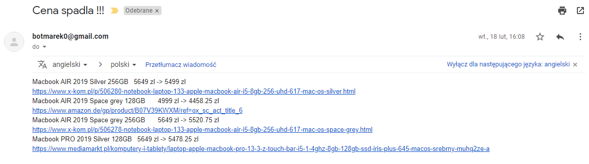

Program zajmuje się zczytywaniem cen ze sklepów (items.json). Zapisuje aktualną wartość w pliku (prices.json) oraz gdy cena uległa zmianie, wysyła maila z powiadomieniem. 
Wszystko działa na maszynie Raspberry Pi z systemem Raspbian. Dzięki usłudze cron-jobs program codziennie o godzinie 16:00 sprawdza wartość laptopów.

